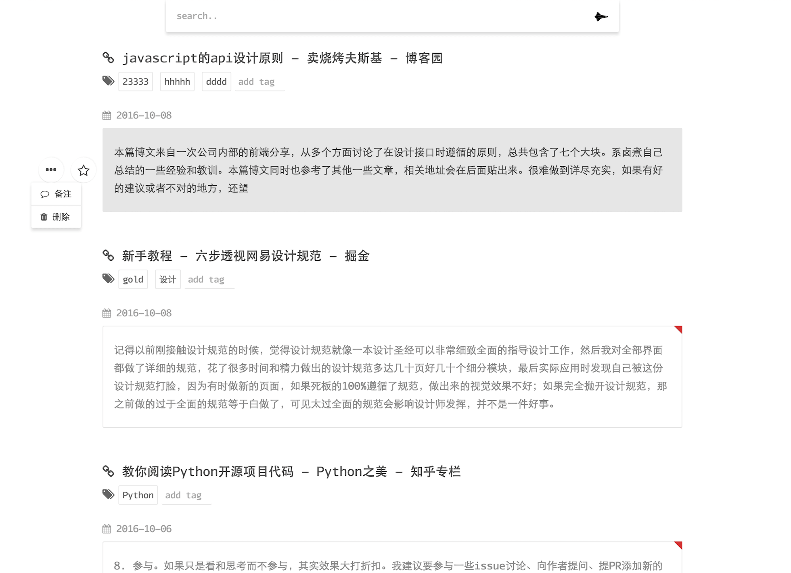
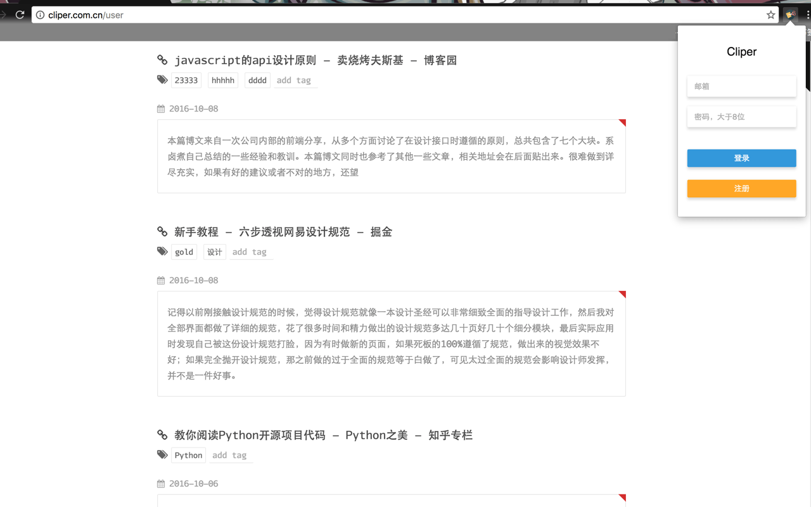

A website to visit your clipers. Visit this: [cliper](http://cliper.com.cn). Also, if your are looking for a chrome extension to save paragraphs you like on websites, you may need this: [cliper chrome extension](https://chrome.google.com/webstore/detail/biijehenaabpogldekblkfgooifmagbi)

## Screen shoots

## Tech

- [koa2](https://github.com/koajs/koa)
- [nunjucks](https://github.com/mozilla/nunjucks)
- [request](https://github.com/request/request)
- [node-config](https://github.com/lorenwest/node-config)
- [react](https://github.com/facebook/react)
- [redux](https://github.com/reactjs/redux)
- [webpack](https://github.com/webpack/webpack)
- [nprogress](https://github.com/rstacruz/nprogress)
- [postcss](https://github.com/postcss/postcss)

## Author

- [ecmadao](https://github.com/ecmadao)

## License

Apache License 2.0
